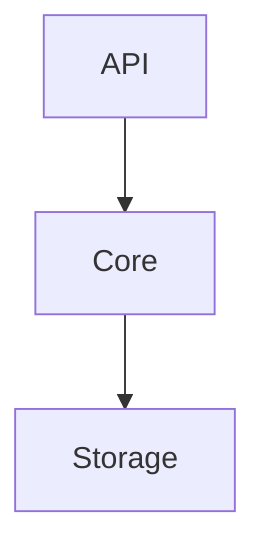

# Car Pooling Service Kata

Design/implement a system to manage car pooling.

You work for a company that takes people from point A to point B.
So far they have done it without sharing cars with multiple groups of people.
This is an opportunity to optimize the use of resources by introducing car
pooling.

You have been assigned to build the car availability service that will be used
to track the available seats in cars.

Cars have a different amount of seats available, they can accommodate groups of
up to 4, 5 or 6 people.

People requests cars in groups of 1 to 6. People in the same group want to ride
on the same car. You can take any group at any car that has enough empty seats
for them. If it's not possible to accommodate them, they're willing to wait until
there's a car available for them. Once a car is available for a group
that is waiting, they should ride.

Once they get a car assigned, they will journey until the drop off, you cannot
ask them to take another car (i.e. you cannot swap them to another car to
make space for another group).

In terms of fairness of trip order: groups should be served as fast as possible,
but the arrival order should be kept when possible.
If group B arrives later than group A, it can only be served before group A
if no car can serve group A.

For example: a group of 6 is waiting for a car and there are 4 empty seats at
a car for 6; if a group of 2 requests a car you may take them in the car.
This may mean that the group of 6 waits a long time,
possibly until they become frustrated and leave.

## API

To simplify the challenge and remove language restrictions, this service must
provide a REST API which will be used to interact with it.

This API must comply with the following contract:

### GET /status

Indicate the service has started up correctly and is ready to accept requests.

Responses:

* **200 OK** When the service is ready to receive requests.

### PUT /cars

Load the list of available cars in the service and remove all previous data
(existing journeys and cars). This method may be called more than once during
the life cycle of the service.

**Body** _required_ The list of cars to load.

**Content Type** `application/json`

Sample:

```json
[
  {
    "id": 1,
    "seats": 4
  },
  {
    "id": 2,
    "seats": 6
  }
]
```

Responses:

* **200 OK** When the list is registered correctly.
* **400 Bad Request** When there is a failure in the request format, expected
  headers, or the payload can't be unmarshalled.

### POST /journey

A group of people requests to perform a journey.

**Body** _required_ The group of people that wants to perform the journey

**Content Type** `application/json`

Sample:

```json
{
  "id": 1,
  "people": 4
}
```

Responses:

* **200 OK** or **202 Accepted** When the group is registered correctly
* **400 Bad Request** When there is a failure in the request format or the
  payload can't be unmarshalled.

### POST /dropoff

A group of people requests to be dropped off. Whether they traveled or not.

**Body** _required_ A form with the group ID, such that `ID=X`

**Content Type** `application/x-www-form-urlencoded`

Responses:

* **200 OK** or **204 No Content** When the group is unregistered correctly.
* **404 Not Found** When the group is not to be found.
* **400 Bad Request** When there is a failure in the request format or the
  payload can't be unmarshalled.

### POST /locate

Given a group ID such that `ID=X`, return the car the group is traveling
with, or no car if they are still waiting to be served.

**Body** _required_ A url encoded form with the group ID such that `ID=X`

**Content Type** `application/x-www-form-urlencoded`

**Accept** `application/json`

Responses:

* **200 OK** With the car as the payload when the group is assigned to a car.
* **204 No Content** When the group is waiting to be assigned to a car.
* **404 Not Found** When the group is not to be found.
* **400 Bad Request** When there is a failure in the request format or the
  payload can't be unmarshalled.

## Requirements

- The service should be as efficient as possible.
  It should be able to work reasonably well with at least $`10^4`$ / $`10^5`$ cars / waiting groups.

## Architecture

This solution is divided into 3 parts:



The API is a thin layer on top that receives requests and translates them to a
format the Core can understand. Once the Core responds, it translates those
responses to a format other HTTP clients can understand and sends that response.

The Core, as the name implies, is the heart of the application. It has all the
business logic. It communicates with a persistence layer, Storage, to save and
recover data if needed.

Storage, is the persistence layer. In this solution, it uses ETS to persist
data in memory, but if we wanted to persists data more permanently in disk, we
could use DETS.

Each layer is independent from each other. Any given layer may only ask things
to the layer bellow it, and in this specific case, respond to queries to the
layer above.

As long as the public API of each layer is the same, changes in each layer are
self contained and invisible to the layers above.

## Efficiency

Following is the BIG O notation of complexity for each endpoint:
 - `PUT /cars` is O(n) where `n` is the number of cars
 - `POST /journey` is O(1)
 - `POST /dropoff` is O(1) in a best case scenario, O(n*m) where `n` is the number
 of cars that have the same amount of free seats and `m` is the number of groups
 waiting for a car. This could be improved by simply returning OK, and then
 asynchronously assign the car to the next passenger.
 - `POST /locate` is O(1)

 It is clear, that the `/dropoff` endpoint is by far the most expensive, but
 this comes with the benefit of all the other endpoints having const Big O
 complexity.
